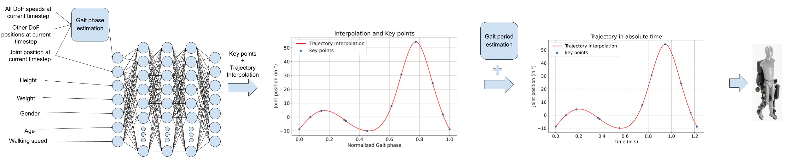
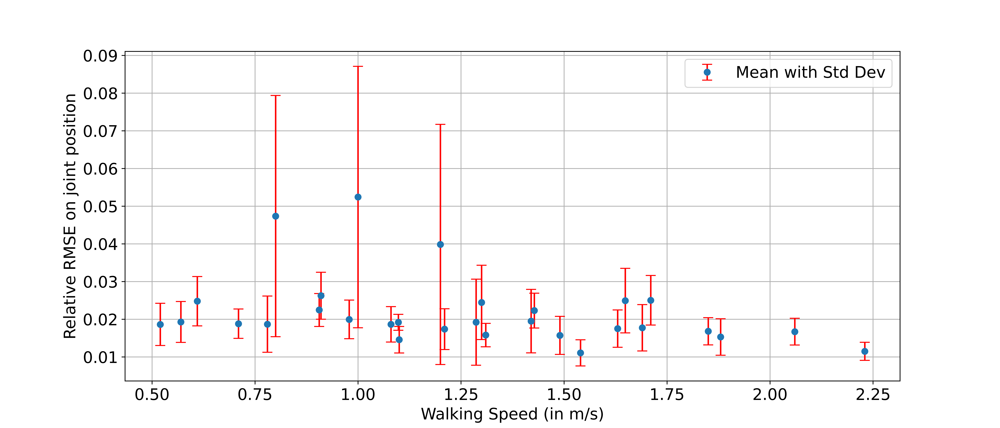

# High-Level Control for Lower-Limb Exoskeletons — DNN + GPR

**Tagline.** Generate hip & knee joint trajectories from user/biomech features using a **Deep Neural Network** (key-points → spline) and **Gaussian Process Regression** (gait period/phase).  
**Snapshot.** Mean relative errors on full trajectories: **knee 5.3%**, **hip flex. 5.8%**, **hip abd. 9.8%**; gait-period RMSE ≈ **0.054 s**.

<p align="center">
  
  <br><em>Method at a glance — key-points → spline trajectory → absolute time via GPR.</em>
</p>

---

## Why this repo?

Robotic exoskeletons need **smooth, reliable joint trajectories** that adapt to the user and context (e.g., speed, incline).  
This repository shares a clean **project structure**, **data instructions**, and **results** of a high-level ML controller:
- **DNN** predicts joint trajectory **key-points** (hip/knee) → **cubic spline** interpolation.
- **GPR** estimates **gait period/phase** to map trajectories into **absolute time**.

> No private data is included. See `data/README.md` for the datasets, how to obtain them legally, and how to prepare your own files or use the **synthetic samples**.

---

## Repository layout

```text
    exoskeleton-high-level-control-ml/
    ├─ data/
    │  ├─ README.md
    │  └─ samples/
    ├─ docs/
    │  └─ figures/
    ├─ research/
    ├─ simulation_models/
    ├─ src/
    │  └─ exo_ml/
    ├─ .gitignore
    └─ README.md
```


---

## Quickstart (no notebooks required)

1) **Clone**
bash git clone https://github.com/AidenPQ/exoskeleton-high-level-control-ml.git
cd exoskeleton-high-level-control-ml

2) (Optional) Environment
python -m venv .venv
# Windows: .venv\Scripts\activate
# Linux/Mac:
source .venv/bin/activate
pip install -U pip

3) (Optional) Minimal deps — for quick plots/metrics:
   pip install numpy pandas matplotlib scikit-learn scipy

4) Data
Read data/README.md: official DOIs/URLs, HDF5 schema (datasetV2.h5), and the CSV mapping for training/eval.

Use the synthetic samples in data/samples/ for quick illustration if you don’t have the real datasets yet.

Data (what matters)

No raw data is redistributed here.

data/README.md documents three public datasets (Embry 2018; Fukuchi 2018; Moreira 2021), the subject → trial → side → angles HDF5 structure (+ speed/incline metadata & demographics), and a flat CSV export recommended for models.

Angle matrices are normalized per gait cycle (150 points/cycle).

Minimal CSV columns recommended:
subject_id, trial_id, side, joint, axis, cycle_idx, cycle_pct, value_deg, speed_mps, incline_deg, age, gender, height_m, weight_kg.

---

# Results — snapshot

Key-point → Spline (degree 3)

Relative RMSE (mean ± std): knee 1.8% ± 1.2%, hip flex. 2.1% ± 3.9%, hip abd. 3.7% ± 2.6%

Vast majority < 6% (rare outliers).

Full trajectory generation (modified complete model)

Mean relative RMSE: knee 5.3%, hip flex. 5.8%, hip abd. 9.8%

Max rel. RMSE observed (transparency): knee 0.21, hip flex. 0.72, hip abd. 1.04

Outliers > 10% markedly reduced vs initial model (~< 7%).

Gait period (GPR, Matérn 1.5)

RMSE test ≈ 0.054 s (≈ 1.35%–10% relative depending on the period).

<p align="center"> <br> <em>GPR — predicted gait period vs speed (95% band).</em> </p> <p align="center"> <br> <em>Interpolation error from key-points for Hip flexion(relative RMSE distribution).</em> </p> <p align="center"> <br> <em>Final trajectory interpolation for Hip flexion.</em> </p>

(Optional transparency) You can also include worst/best case plots in docs/figures/worst_cases_modified.png and docs/figures/best_cases_modified.png.

---

# How it works (short)

Key-points: DNN predicts a compact set of joint key-points (hip/knee).

Spline: a cubic spline reconstructs a continuous trajectory over the normalized gait cycle (0–100%).

GPR: a Gaussian Process (Matérn 1.5) predicts the gait period/phase, mapping the trajectory to absolute time.

Evaluation: relative RMSE per joint + best/worst cases for transparency.

---

# Reuse

No license is granted. All rights reserved by the author.
If you wish to reuse parts of the code, figures, or methodology, please open an Issue to request permission.

---

# Cite

If this repository informs your work, please cite as:

Ngandjui Tiako, P. Q. (2024–2025). High-Level Control for Lower-Limb Exoskeletons — DNN + GPR. Repository: AidenPQ/exoskeleton-high-level-control-ml.

---

# Contact

LinkedIn — Pierre Quentin NGANDJUI TIAKO:
https://www.linkedin.com/in/pierre-quentin-ngandjui-tiako-006975180/
